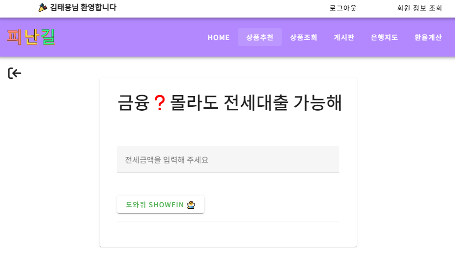
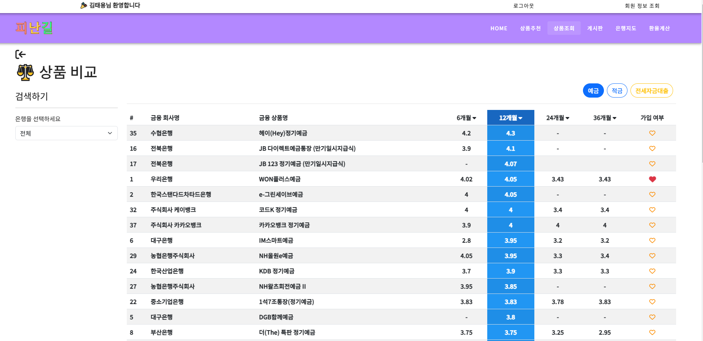
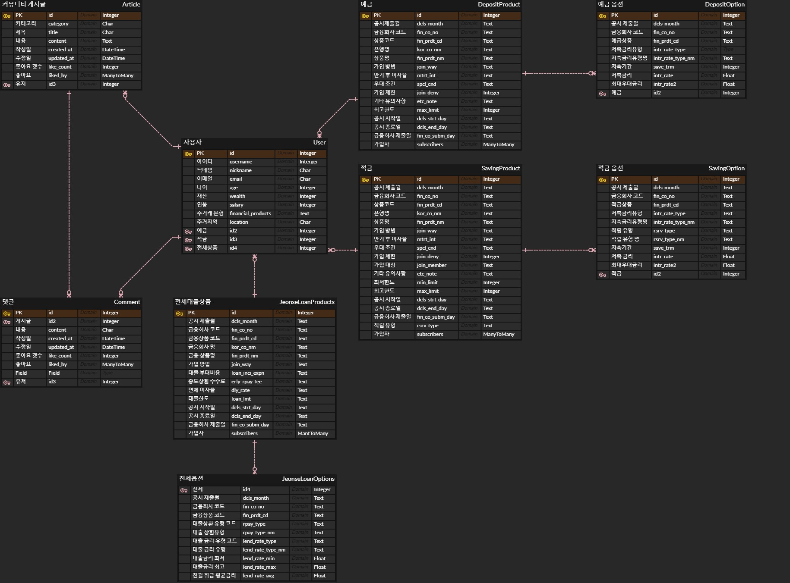

## 💡 개요

- 진행기간 : 2023.11.16(목) ~ 2023.11.24(금)
- 주제 : 금융을 **"모르는"** 젊은이를 위한 예적금 비교 및 대출 추천
- 프로젝트명 : **_Show Fin_**
- 팀명 : Finance Road (피난길)
- 구성원 :

|팀장|팀원|
|:-:|:-:|
|<a href="https://github.com/malrangcow00"></a>|<a href="https://github.com/GATBAWI"></a>|
|[MalrangCow](https://github.com/malrangcow00)|[GATBAWI](https://github.com/GATBAWI)|


## 💁‍♂️ 서비스 소개

- 금리? 이자? 대출?... 금융에 대해 친근하지 못한 사람을 위해 저희는 'ShowFin'라는 애플리케이션을 통해 예적금 상품 비교 및 상품 추천 서비스를 제공합니다. ShowFin은 부담없이 자주 이용하는 인터넷 쇼핑에서 착안하여 금융상품을 시각적으로 편하게 볼 수 있도록 정리하여 제공합니다.

- 최소한의 정보(금리)를 이용해서 편하게 예적금을 비교할 수 있습니다. 또한 원하는 위치의 집 전세금을 이용하여 대출을 받게 된다면 한달에 얼마나 갚아야(상환) 하는지 클릭 한번으로 알 수 있습니다.

## 📺 서비스 화면

 

## 🦾 주요 기능

- 메인페이지

  - 사이트 첫 화면. 주요 기능에 대한 링크와 간략한 안내를 포함
  - 로그인과 로그아웃시 접근 기능의 분리
  - 필수 기능 및 사용자의 관심을 끌 수 있는 콘텐츠(상품 추천, 상품조회, 게시판, 환율계산기 기능)를 네비게이션 바를 통해 제공

- 회원 관리

  - 회원 가입을 통해 개인 정보를 등록하고, 로그인을 통해 상품 가입, 게시글 작성 및 수정 기능 접근 가능
  - 비밀번호 변경이나 회원 정보 수정 기능 포함
  - 로그인한 사용자의 경우, 마이페이지에서 정보 확인 및 가입 상품 조회

- 예적금 상품 조회

  - 다양한 은행들의 예적금 상품의 최신 금리 정보를 제공
  - 각 상품의 금리를 기준으로 정렬하여 사용자가 가장 유리한 예적금 상품을 선택할 수 있도록 도와줌

- 커뮤니티 게시

  - 피난길 회원들 간의 소통과 정보 공유를 위한 공간. 회원들은 금융에 관련된 질문이나 정보를 게시하고, 다른 회원들과 의견을 나눌 수 있음.

- 각종 편의 기능
  - 근처 은행 검색 : 검색어를 활용하여 주변에 위치한 은행을 검색
  - 환율조회 및 환율 계산 : 사용자가 현재 환율 정보를 조회하고 환율 계산을 할 수 있도록 도움.
  - 한눈에 비교하는 가입상품 : 차트를 활용하여 가입한 상품의 금리를 비교 할 수 있도록 편의기능 제공.

## 🧬 데이터베이스 모델링 (ERD)



## ⚙ 금융 상품 추천 알고리즘 (대출 추천)

저희 알고리즘은 **_다양한 사용자의 정보를 기반_**으로 현재 사용자의 정보와 유사한 **_조건의 사용자들이 많이 가입한 금융 상품_**들을 내림차순으로 보여줍니다.

대출 상품을 추천하는 알고리즘은 내가 살고싶은 집의 **전세금**을 기반으로 현재 서버에 저장된 대출상품의 대출한도와 대출이자를 이용하여 최대금액을 대출(내림차순)하고 최소비용의 상환(오름차순)으로 계산된 정보를 제공합니다.

```js
numbers.sort((a, b) => a - b); // 오름차순
numbers.sort((a, b) => b - a); // 내림차순
```

1. 사용자가 input 필드에 전세금을 입력하고 버튼을 클릭하면, 데이터베이스에 저장된 대출 상품의 대출한도와 대출이자를 이용하여 적용된 LTV % 값과, 최대 상환 금액과 최소 상환 금액 계산합니다.
2. 대출 이자 필드는 문자열 필드로 %를 포함한 문자열이거나, 공백으로 구성되어 있습니다.  
   %로 구성된 문자열의 경우 %를 제거하고 숫자만 파싱하여 계산에 이용합니다.
3. 가장 많은 대출금액과 가장 적은 월 상환금액을 기준으로 정렬된 상품의 상품 코드를 이용하여 첫번째 요소를 추천하여 전세금과 이자를 다시 계산하고 상품을 반환하여 추천합니다.

## 🚀 사용한 API

- 금융감독원 API
- 한국수출입은행 환율정보
- 카카오맵
