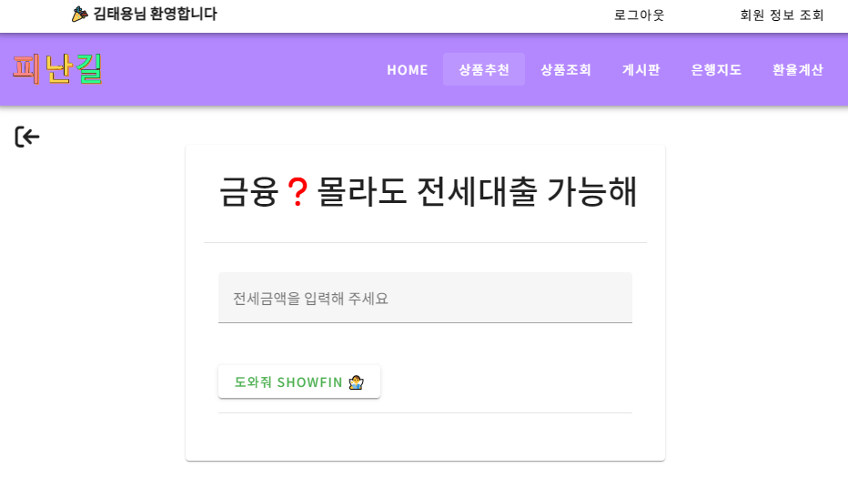
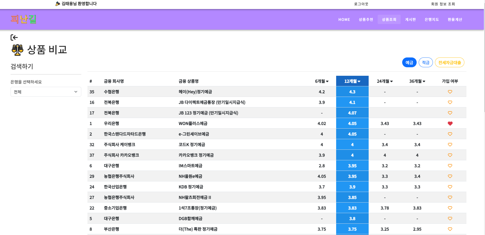
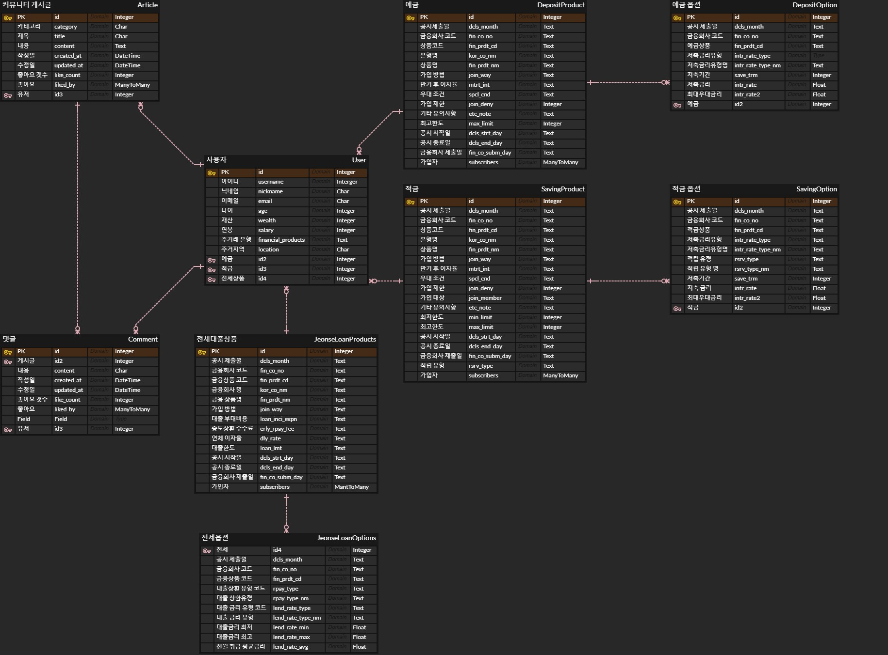

## 💡개요

- 진행기간 : 2023.11.16(목) ~ 2023.11.24(금)
- 주제 : 금융을 **"모르는"** 젊은이를 위한 예적금 비교 및 대출 추천
- 팀명 : Finance Road (피난길)
- 구성원 :
  - 팀장 : 이재평 [Github](https://github.com/malrangcow00)
  - 팀원 : 김태용 [Github](https://github.com/GATBAWI)
- 프로젝트명 : **_Show Fin_**

## 💁‍♂️ 서비스 소개

- 금리? 이자? 대출?... 금융에 대해 친근하지 못한 사람을 위해 저희는 'ShowFin'라는 애플리케이션을 통해 예적금 상품 비교 및 상품 추천 서비스를 제공합니다. ShowFin은 부담없이 자주 이용하는 인터넷 쇼핑에서 착안하여 금융상품을 시각적으로 편하게 볼 수 있도록 정리하여 제공합니다.

- 최소한의 정보(금리)를 이용해서 편하게 예적금을 비교할 수 있습니다. 또한 원하는 위치의 집 전세금을 이용하여 대출을 받게 된다면 한달에 얼마나 갚아야(상환) 하는지 클릭 한번으로 알 수 있습니다.

## 📺서비스 화면

 

## 🦾주요 기능

- 메인페이지

  - 사이트 첫 화면. 주요 기능에 대한 링크와 간략한 안내를 포함
  - 로그인과 로그아웃시 접근 기능의 분리
  - 필수 기능 및 사용자의 관심을 끌 수 있는 콘텐츠(상품 추천, 상품조회, 게시판, 환율계산기 기능)를 네비게이션 바를 통해 제공

- 회원 관리

  - 회원 가입을 통해 개인 정보를 등록하고, 로그인을 통해 상품 가입, 게시글 작성 및 수정 기능 접근 가능
  - 비밀번호 변경이나 회원 정보 수정 기능 포함
  - 로그인한 사용자의 경우, 마이페이지에서 정보 확인 및 가입 상품 조회

- 예적금 상품 조회

  - 다양한 은행들의 예적금 상품의 최신 금리 정보를 제공
  - 각 상품의 금리를 기준으로 정렬하여 사용자가 가장 유리한 예적금 상품을 선택할 수 있도록 도와줌

- 커뮤니티 게시

  - 피난길 회원들 간의 소통과 정보 공유를 위한 공간. 회원들은 금융에 관련된 질문이나 정보를 게시하고, 다른 회원들과 의견을 나눌 수 있음.

- 각종 편의 기능
  - 근처 은행 검색 : 검색어를 활용하여 주변에 위치한 은행을 검색
  - 환율조회 및 환율 계산 : 사용자가 현재 환율 정보를 조회하고 환율 계산을 할 수 있도록 도움.
  - 한눈에 비교하는 가입상품 : 차트를 활용하여 가입한 상품의 금리를 비교 할 수 있도록 편의기능 제공.

## 🧬데이터베이스 모델링(ERD)



## ⚙금융 상품 추천 알고리즘(대출 추천)에 대한 기술적 설명

저희 알고리즘은 **_다양한 사용자의 정보를 기반_**으로 현재 사용자의 정보와 유사한 **_조건의 사용자들이 많이 가입한 금융 상품_**들을 내림차순으로 보여줍니다.

대출 상품을 추천하는 알고리즘은 내가 살고싶은 집의 **전세금**을 기반으로 현재 서버에 저장된 대출상품의 대출한도와 대출이자를 이용하여 최대금액을 대출(내림차순)하고 최소비용의 상환(오름차순)으로 계산된 정보를 제공합니다.

```js
numbers.sort((a, b) => a - b); // 오름차순
numbers.sort((a, b) => b - a); // 내림차순
```

1. 사용자가 input 필드에 전세금을 입력하고 버튼을 클릭하면, 데이터베이스에 저장된 대출 상품의 대출한도와 대출이자를 이용하여 적용된 LTV % 값과, 최대 상환 금액과 최소 상환 금액 계산합니다.
2. 대출 이자 필드는 문자열 필드로 %를 포함한 문자열이거나, 공백으로 구성되어 있습니다.  
   %로 구성된 문자열의 경우 %를 제거하고 숫자만 파싱하여 계산에 이용합니다.
3. 가장 많은 대출금액과 가장 적은 월 상환금액을 기준으로 정렬된 상품의 상품 코드를 이용하여 첫번째 요소를 추천하여 전세금과 이자를 다시 계산하고 상품을 반환하여 추천합니다.

## 🎡작업

## 11월 16일(목)

- 김태용

  > - 사이트 전체 기획 및 ERD 작성
  > - 컴포넌트 구조 생성
  > - 업무 분담 및 메인 페이지 기본 와이어프레임 구성
  >
  > **문제점 개선 및 논의 사항**
  >
  > ERD 작성 과정에서 부터 어려움이 있었다. sqlite는 중개 테이블을 활용하지 않으므로 그에 맞는 ERD ver.1을 작성했다.

- 이재평
  > - 팀명 / 프로젝트명 결정
  > - 깃 프로젝트 생성
  > - 기본 프로젝트 / 앱 / 컴포넌트 구조 생성
  > - 개별 브랜치 생성 및 팀원 권한 부여
  > - 게시글 모델 생성
  > - 업무 분담 및 메인 페이지 기본 틀 구현

---

## 11월 17일(금)

- 김태용

  > - 회원관리 기능 : django-rest-auth 사용해서 기본 회원 관리 api 구현, custom user 메서드 및 serializer 구현
  >
  > **문제점 개선 및 논의 사항**
  >
  > 1.  목요일 하루를 django-rest-auth 커스텀으로 밤늦게까지 공부함.  
  >     커스텀 회원가입과 로그인, 커스텀 회원정보 수정, 비밀번호 변경 기능 구현
  > 2.  merge issue : merge 할 줄 몰라서 zip 파일로 매번 받아서 사용함 → SourceTree를 활용하여 극!복!

- 이재평
  > - 필요 API 서비스 가입 및 KEY 발급
  > - 지도 출력 / 환율 계산기 구조 생성

---

## 11월 18일(토)

- 김태용
  > - vuetify 학습 : vuetify를 이용하여 전체적인 틀을 잡고, 세부 요소는 익숙한 부트스트랩을 활용하여 작업하기 위함
  >
  > **문제점 개선 및 논의 사항**
  >
  > 1.  부트스트랩은 클래스 위주? 로 조작을 진행했었는데, vuetify는 뭔가 html태그 그 자체가 스타일을 줘서 낯설었음 → 처음으로 GPT를 활용하여 Vue2 코드를 Vue3 코드로 변환하며 학습함

---

## 11월 19일(일)

- 김태용
  > - 게시판 기능 CRUD 기능의 django 작업 완료
  > - 댓글 기능의 CRUD 기능의 django 작업 완료
  > - 게시글과 댓글의 좋아요 기능 구현  
  >   **문제점 개선 및 논의 사항**
  >
  > 1.  게시판과 댓글 사이의 역참조 구현 과정에서 모델\_set의 오타로 인해 시간 낭비
  > 2.  좋아요 기능 구현시 게시글을 좋아요하면 댓글까지 같이 좋아요가 발생하는 사태 발생 → 댓글과 게시글의 좋아요 URL 분리

---

## 11월 20일(월)

- 김태용

  > - 회원가입 Vue 기능 구현
  >
  > **문제점 개선 및 논의 사항**
  >
  > 1.  axios 과정에서 CORS 이슈, 권한 이슈, 헤더 생략 이슈 등 포스트맨으로 테스트할때와 다르게 복합적인 문제 발생 → pinia를 이용하여 스토어에 모든 정보를 저장하고 토큰과 로그인 상태를 확인하여 회원가입, 로그인, 회원정보조회, 회원정보 수정, 비밀번호 변경 기능 구현

- 이재평
  > - 지도 기능 구현
  > - 상품 정보 조회 업데이트
  > - 환율 계산기 구조 개선

---

## 11월 21일(화)

- 김태용

  > - 게시글 및 댓글 Vue 기능 구현
  >
  > **문제점 개선 및 논의 사항**
  >
  > 1.  저장소의 토큰과 로그인상태를 이용하여 게시글의 CRUD 및 댓글 CRUD 기능 구현
  > 2.  게시글과 댓글의 좋아요는 내일 처리할 예정

- 이재평
  > - 지도 기능 개선
  > - 환율 계산기 기능 구현

---

## 11월 22일(수)

- 김태용

  > - 사이트 디자인 시작 : 디자인 상의 컨셉 상의
  >   - 페이지 틀 수정 및 컴포넌트 재생성
  >   - 회원관리 기능 관련 페이지 css
  >
  > **문제점 개선 및 논의 사항**
  >
  > 1.  vue 컴포넌트에서 style 태그에 css를 정의했을때, 전역에 적용됨 → scoped 속성을 추가
  > 2.  동일 페이지로 router push 하는 경우 에러발생

- 이재평
  > - 지도 기능 완성
  > - 환율 계산기 기능 완성
  > - 메인 페이지 디자인 구현

---

## 11월 23일(목)

- 김태용

  > - 전체 폰트 및 색상 통일 → Nato-Sans
  > - 예적금 상품, 대출 상품 조회 및 저장을 위한 django 기능 구현
  > - 예적금 상품, 대출 상품에 대한 가입을 구현하기 위해, 각 상품에 ManyToMany 필드를 이용하고 UserSerializer를 불러와 해당 필드 추가
  > - 예적금 상품 추천 : 최고 우대 금리 정렬 구현
  > - 사이트 전반적인 css 세부사항 조정 및 오탈자 확인
  > - 네비게이션 가드를 이용하여 접근 제한 처리
  >
  >   **문제점 개선 및 논의 사항**
  >
  > 1.  컴포넌트 개수가 급증 but 미리 폴더 구조를 구조적으로 만들어두지 않아 어려움 있음. → 현 상황에서 수정이 어렵다고 판단, 폴더 구조를 새로 만들지는 x
  > 2.  회원 인증 기능에서 사용자가 잘못된 정보 입력 시 사용자에게 알려주는 기능 추가 → Vuetify를 활용하여 시각적으로 표현, alert 사용
  > 3.  다른 페이지로 이동이 가능한 요소들 중 cursor가 pointer 되지 않는 부분들 수정 필요 → 수정 진행 中

- 이재평
  > - 메인 페이지 디자인 개선
  > - 상품 정보 조회 디자인 업데이트
  > - 환율 계산기 오류 수정 및 기능 개선

---

- 이재평

> **문제점 개선 및 논의 사항**  
>  환율 계산기의 사용자 경험을 고려하면 일반적으로 숫자를 하나씩 추가할 경우 세 자리 수마다 단위 쉼표가 추가 되는 것이 아닐 수 있어 별도의 처리가 필요함.
> 숫자 입력이 멈추는 시점을 자동으로 감지하여 변환하는 것은 자바스크립트만으로는 쉽지 않음.
> 사용자가 입력을 멈출 때까지 대기하는 것은 입력의 이벤트(ex: 키 입력)를 계속해서 감지하는 방식으로 구현하는데, 이는 일반적으로 사용자 경험에 좋지 않음.
> 사용자가 입력을 마치고 변환을 원할 때는 보통 명시적으로 특정 이벤트(ex: 엔터 키를 누름)를 사용하여 변환하도록 유도하는 방법밖에 없음.
> 입력이 멈추고 변환이 필요한 시점을 어떻게 감지할지에 대해 추가적인 방법으로 디바운스(입력이 멈춘 후 일정 시간이 지난 후에 실행) 등의 방법을 사용해 보았지만 실패.
> 효율은 떨어지지만 결국 입력마다 값을 받아와서 필터링 후 다시 단위 쉼표를 삽입하여 출력하는 방식으로 구현

---
