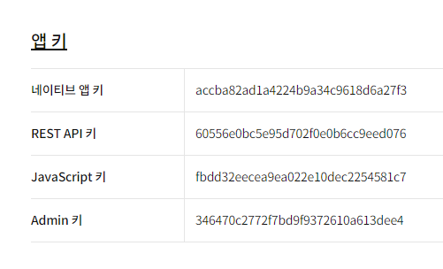

# 팀명: Finan길

# 프로젝트명: ShowFin

노션 주소: https://github.com/malrangcow00/ShowFin.git

# 금융 상품 비교 앱

https://jealous-falcon-f89.notion.site/Finan-4f1c724f1dec49a7ba83aeb1e2910634?pvs=4

### 메인페이지
- 최소한5개 이상의 URL 페이지를 사용

1. 예적금 금리 비교 Product 
API
 ProductLIst
      필터링 / 정렬 가능하도록...
   - 은행
   - 예치기간
- 
productDetail 

2. 환율 계산
API 받아와서 ..

   
 국가정보만 두개 입력하는데
. interest

화면단은 하난데..
원화를 입력하면 아래 선택한 국가의 화폐단위 표시
타국 통화 입력 선택시 

3. 집 주변 은행

4. 상품 추천
   프로필에 입력되는 정보
   나이, 자산, 연봉
   나와 나이, 현재 가진 금액, 연봉의 분포가 비슷한 사람들이 가입한 상품을 10개 추천합니다. (Numpy 사용)

상품 모델
- id

프로필 
- id, 가입한 상품 목록(상품 id), 유저이름, 나이, 자산, 연봉, 이메일, 

# 가져와야할 API
### 금융감독원 API
- https://finlife.fss.or.kr/finlife/main/contents.do?menuNo=700029
- fin_API_URL = 'f5e5273d3415b407b8b70072028c8174
  '
### 한국수출입은행 환율정보 API (환율 계산기)
- https://www.koreaexim.go.kr/ir/HPHKIR020M01?apino=2&viewtype=C&searchselect=&searchword=
- exchange_API_URL = '9tvmZZArSdQ9sEmu0hZG0wnAU40eZthD'
- https://www.koreaexim.go.kr/site/program/financial/exchangeJSON?authkey=9tvmZZArSdQ9sEmu0hZG0wnAU40eZthD&data=AP01

### 카카오맵 API
- https://apis.map.kakao.com/
- map_API_URL = 'fbdd32eecea9ea022e10dec2254581c7'
- 

환율 계산기 힘들었던 점

일반적으로 숫자를 하나씩 입력하여 뒤에 숫자를 계속 추가할경우 결과값의 세자리마다 쉼표가 들어가는것이 아니게 될 수도 있어서 별도의 처리가 필요

숫자 입력이 멈추는 시점을 자동으로 감지하여 변환하는 것은 자바스크립트만으로는 쉽지 않다. 
사용자가 입력을 멈출 때까지 대기하는 것은 입력의 이벤트(ex: 키 입력)를 계속해서 감지하는 방식으로 구현하는데, 이는 일반적으로 사용자 경험에 좋지 않음.

사용자가 입력을 마치고 변환을 원할 때는 보통 명시적으로 특정 이벤트(ex: 엔터 키를 누름)를 사용하여 변환하도록 유도하는 방법밖에 없다...

자동으로 변환하는 것이 필요하다면... 입력이 멈추고 변환이 필요한 시점을 어떻게 감지할지에 대해 추가적인 방법이 필요함. 
이는 사용자 경험이나 요구사항에 따라 다를 수 있으며, 주로 디바운스(입력이 멈춘 후 일정 시간이 지난 후에 실행) 등의 방법을 사용한다.
하지만 이는 구현이 복잡하고, 사용자 경험이 좋지 않을 수 있다.

네이버랑 동일하게 됨

프론트 지망은 아니지만 해당 기능을 만들게 되면서 
유저 인터페이스적인 면에서 시각적인 부분도 뿐만 아니라 이렇게 구체적인 유저 경험을 고려하는 것도 중요하다고 느꼈습니다.